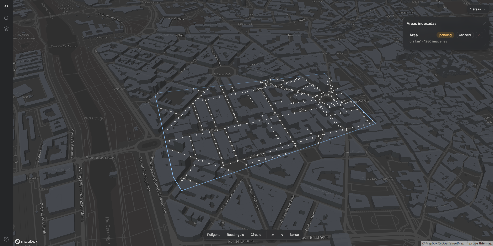
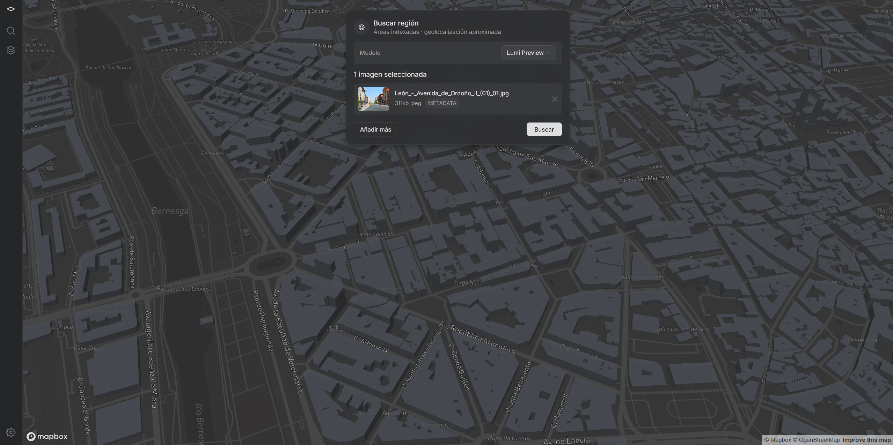
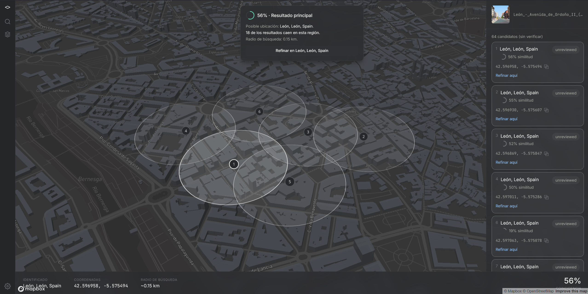

#  Lumi

Herramienta de geolocalización a partir de imágenes a nivel de calle,
self-hosted. Subís una foto tomada en la calle y el sistema busca, dentro de
un índice que vos mismo generás para una zona concreta, el punto capturado
que más se parece — con coordenadas, radio de confianza y verificación
geométrica opcional.

> **Nota de alcance:** este es un proyecto de prueba de concepto (PoC), no un
> producto terminado. Ver [`docs/PROOF_OF_CONCEPT.md`](docs/PROOF_OF_CONCEPT.md)
> para el detalle de qué está resuelto, qué está deliberadamente fuera de
> alcance, y los riesgos/limitaciones conocidos (incluido un tema de
> Términos de Servicio de Google Maps Platform que conviene leer antes de
> usar esto contra datos reales).

---

## Qué hace, en capturas reales

**1. Indexar un área.** Dibujás un polígono sobre el mapa, el sistema
samplea puntos siguiendo la red de calles real (vía Overpass/OpenStreetMap,
no un grid ciego) y lanza un job de indexado en segundo plano.



**2. Subir una imagen y elegir modelo.** El pase de retrieval usa el modelo
expuesto como **Lumi Preview**; podés tener más de un modelo disponible en
`/settings`.



**3. Resultados agrupados por zona, con nivel de confianza.** Los candidatos
del top-k se agrupan espacialmente en regiones (círculos translúcidos =
radio de confianza), cada uno con su % de similitud y estado
(`unreviewed`/`confirmed`). Desde ahí podés pedir un refinamiento más caro
(verificación geométrica) sobre una región concreta.



---

## Arquitectura

```
Imagen query
   │
   ▼
Lumi Preview (MegaLoc congelado) ──► descriptor 8448-d L2-normalizado
   │
   ▼
Búsqueda por similitud coseno (pgvector) + clustering espacial (regiones)
   │
   ▼
Top-k candidatos por región, con lat/lng/heading/pano_id
   │
   ▼ (solo bajo demanda, al pulsar "Refinar")
Verificación geométrica: Laila (RoMa congelado) sobre el top-k de la región
   │
   ▼
Resultado final: coordenadas exactas + score + imagen(es) de referencia
```

- **`apps/web`** — Next.js (App Router). Dashboard de búsqueda, panel de
  indexado, gestión de áreas, settings y wizard de primer arranque
  (`/setup`). El mapa (Mapbox/MapLibre) se monta client-only.
- **`apps/worker`** — worker Node que consume la cola de jobs de indexado:
  llama a Overpass, descarga imágenes de Street View, las manda en batch al
  servicio de inferencia, y escribe progreso para que `/index` lo lea por SSE.
- **`services/inference`** — FastAPI (Python) con MegaLoc y RoMa cargados en
  memoria una sola vez al arrancar. Expone `POST /embed` y `POST /verify`.
  Nunca se llama a PyTorch directamente desde Node.
- **`packages/`** — código compartido: tipos TS (`shared-types`), sampling
  de calles sobre Overpass (`geo-sampling`), repositorio de settings cifrados
  (`settings-repo`), tracking de uso/coste de API (`api-usage`).
- **`db/`** — migraciones SQL (node-pg-migrate) para Postgres +
  **pgvector** (similitud de embeddings) + **PostGIS** (consultas
  espaciales por área/polígono).
- **Cola de jobs:** **pg-boss** sobre el propio Postgres — no hay Redis en
  el stack (Redis no tiene soporte oficial en Windows, que es el target de
  despliegue principal).

## Stack

| Capa | Tecnología |
|---|---|
| Frontend/API | Next.js 14 (App Router), TypeScript, Tailwind CSS |
| Mapa | Mapbox GL JS / MapLibre GL JS + turf.js |
| Worker | Node.js + pg-boss |
| Inferencia | FastAPI, PyTorch (CUDA), MegaLoc (retrieval), RoMa (verificación) |
| Base de datos | PostgreSQL + pgvector + PostGIS |
| Monorepo | pnpm workspaces |

## Requisitos

> Para una guía completa paso a paso (Windows y Linux, incluyendo cómo usar
> una base de datos remota en vez de la de Docker local), ver
> [`INSTALL.md`](./INSTALL.md). Lo de acá abajo es la versión rápida.

- Node.js + [pnpm](https://pnpm.io/installation)
- Python 3 (para `services/inference`)
- Docker + Docker Compose (para Postgres con pgvector/PostGIS preinstalados)
- (Recomendado) GPU NVIDIA — el servicio de inferencia corre en CPU si no
  hay GPU, pero considerablemente más lento
- Una API key de Google Street View Static API (se pide en el wizard de
  `/setup`)

## Instalación rápida

Si recibiste un instalador (`dist/LumiSetup-<version>.exe` en Windows,
`dist/LumiSetup-<version>.sh` en Linux/Pop!_OS): ejecutalo. Verifica que
tengas Node.js + pnpm y Docker (Docker Desktop en Windows, Docker Engine en
Linux — avisa y te deja seguir sin él si falta), copia archivos, crea `.env`
desde `.env.example`, levanta Postgres vía `docker compose`, corre
`pnpm install --filter @netryx/db...`, y deja un acceso directo (`lumi.exe` /
`lumi`, más entrada en el menú de aplicaciones en Linux) que abre el
navegador en `/setup` para el wizard de primer arranque (dependencias de
Python, descarga de pesos del modelo, esquema de base de datos, API key).

### Modo desarrollo (fuentes, sin instalador)

```bash
cp .env.example .env   # una vez
python3 tools/build.py
python3 tools/build.py --tui   # dashboard interactivo (requiere `pip install textual`)
```

Levanta todo el stack con las fuentes en modo dev: Postgres (Docker),
migraciones pendientes, el servicio de inferencia si ya corriste `/setup`
(uvicorn con `--reload`), el worker, y `next dev` — abre el navegador en
`http://localhost:3000` y corta todo con Ctrl+C. Funciona igual en Windows y
en Linux (usa `venv/Scripts/...` o `venv/bin/...` según el host).

Si preferís levantar cada pieza a mano en vez de `tools/build.py`:

```bash
# 1. Variables de entorno
cp .env.example .env

# 2. Base de datos (Postgres + pgvector + PostGIS vía Docker)
pnpm db:up
pnpm db:migrate

# 3. Dependencias del monorepo
pnpm install

# 4. Servicio de inferencia (en otra terminal)
cd services/inference
python3 -m venv venv                                # "python" en Windows
venv/bin/pip install -r requirements.txt             # venv/Scripts/pip.exe en Windows
venv/bin/python -m uvicorn main:app                  # venv/Scripts/python.exe en Windows

# 5. Web + worker
pnpm --filter @netryx/web dev
pnpm --filter @netryx/worker start
```

La primera vez, la app te lleva a `/setup` — un wizard que valida
prerequisitos, descarga los pesos de los modelos y te pide la API key de
Street View antes de dejarte indexar ninguna área. En Linux, el wizard
detecta el host automáticamente y no ofrece el toggle WSL2 (solo tiene
sentido arrancando desde Windows).

### Otros comandos útiles

```bash
pnpm db:logs     # logs del contenedor de Postgres
pnpm db:down     # apagar (los datos persisten en el volumen)
pnpm db:reset    # apagar + borrar volumen + levantar limpio
pnpm test        # tests de todo el monorepo
pnpm build       # build de todo el monorepo
```

## Empaquetar un instalador distribuible (para maintainers)

```bash
services/inference/venv/bin/pip install pyinstaller   # una vez — Scripts/pip.exe en Windows
python3 tools/build.py release
```

Compila `apps/web` (`next build --standalone`) y `apps/worker` (esbuild),
los empaqueta junto con el resto del proyecto (sin `node_modules` propios,
entornos virtuales de Python, cachés de pesos de modelo ni historial de
`.git`), y genera el instalador nativo de la plataforma en la que corriste
el comando: `dist/LumiSetup-<version>.exe` (Inno Setup) en Windows,
`dist/LumiSetup-<version>.sh` (script bash autoextraíble, sin dependencias
externas) en Linux. Ver el docstring de `tools/build.py` para las flags de
`release` (`--version`, `--keep-staging`; `--nopublish`/`--versionnotes`
están reservadas para un futuro flujo de publicación a GitHub Releases,
todavía no implementado).

## Documentación

Todo el detalle de diseño y las decisiones de arquitectura viven en
`docs/`: spec inicial del fork, setup de base de datos, pipeline de
indexado, pass 1/pass 2 de búsqueda, tracking de coste, UI del dashboard y
del wizard de setup. Es la referencia si querés levantar cada pieza a mano
o entender por qué se tomó tal o cual decisión.

## Benchmarks

`scripts/benchmark.py` mide throughput de embedding, latencia de
verificación geométrica, escala del índice pgvector y proyecta coste/tiempo
de indexado por área. Ver [`docs/PROOF_OF_CONCEPT.md`](docs/PROOF_OF_CONCEPT.md#4-benchmarks)
para el detalle y los resultados.

## Licencia y atribución

Este proyecto construye sobre pesos congelados de **MegaLoc** (MIT) y
**RoMa**, sin fine-tuning propio. Ver `docs/PROOF_OF_CONCEPT.md` para el
detalle de qué modelos se usan y sus términos.