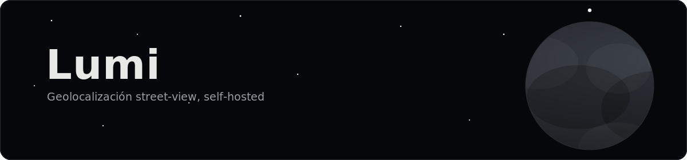

<p align="center">
  
</p>

<p align="center">
  
  
  
  
  
  
</p>

<p align="center">
  Subes una foto tomada en la calle y el sistema busca, dentro de un índice
  que tú mismo generas para una zona concreta, el punto capturado que más
  se parece — con coordenadas, radio de confianza y verificación geométrica
  opcional.
</p>

<p align="center">
  <a href="./INSTALL.md"><b>Guía de instalación</b></a> ·
  <a href="docs/PROOF_OF_CONCEPT.md">Alcance y limitaciones</a> ·
  <a href="#documentacion">Documentación</a>
</p>

---

> **Nota de alcance:** este es un proyecto de prueba de concepto (PoC), no un
> producto terminado. Ver [`docs/PROOF_OF_CONCEPT.md`](docs/PROOF_OF_CONCEPT.md)
> para el detalle de qué está resuelto, qué está deliberadamente fuera de
> alcance, y los riesgos/limitaciones conocidos (incluido un tema de
> Términos de Servicio de Google Maps Platform que conviene leer antes de
> usar esto contra datos reales).

## Contenido

- [Qué hace, en capturas reales](#capturas)
- [Arquitectura](#arquitectura)
- [Stack](#stack)
- [Instalación](#instalacion)
- [Empaquetar un instalador distribuible](#empaquetar)
- [Documentación](#documentacion)
- [Benchmarks](#benchmarks)
- [Licencia y atribución](#licencia)

<h2 id="capturas"></h2>

**1. Indexar un área.** Dibujas un polígono sobre el mapa, el sistema
samplea puntos siguiendo la red de calles real (vía Overpass/OpenStreetMap,
no un grid ciego) y lanza un job de indexado en segundo plano.


**2. Subir una imagen y elegir modelo.** El pase de retrieval usa el modelo
expuesto como **Lumi Preview**; puedes tener más de un modelo disponible en
`/settings`.


**3. Resultados agrupados por zona, con nivel de confianza.** Los candidatos
del top-k se agrupan espacialmente en regiones (círculos translúcidos =
radio de confianza), cada uno con su % de similitud y estado
(`unreviewed`/`confirmed`). Desde ahí puedes pedir un refinamiento más caro
(verificación geométrica) sobre una región concreta.


---

<h2 id="arquitectura"></h2>

```
Imagen query
   │
   ▼
Lumi Preview (MegaLoc congelado) ──► descriptor 8448-d L2-normalizado
   │
   ▼
Búsqueda por similitud coseno (pgvector) + clustering espacial (regiones)
   │
   ▼
Top-k candidatos por región, con lat/lng/heading/pano_id
   │
   ▼ (solo bajo demanda, al pulsar "Refinar")
Verificación geométrica: Laila (RoMa congelado) sobre el top-k de la región
   │
   ▼
Resultado final: coordenadas exactas + score + imagen(es) de referencia
```

| Componente | Responsabilidad |
|---|---|
| **`apps/web`** | Next.js (App Router). Dashboard de búsqueda, panel de indexado, gestión de áreas, settings y wizard de primer arranque (`/setup`). El mapa (Mapbox/MapLibre) se monta client-only. |
| **`apps/worker`** | Worker Node que consume la cola de jobs de indexado: llama a Overpass, descarga imágenes de Street View, las manda en batch al servicio de inferencia, y escribe progreso para que `/index` lo lea por SSE. |
| **`services/inference`** | FastAPI (Python) con MegaLoc y RoMa cargados en memoria una sola vez al arrancar. Expone `POST /embed` y `POST /verify`. Nunca se llama a PyTorch directamente desde Node. |
| **`packages/`** | Código compartido: tipos TS (`shared-types`), sampling de calles sobre Overpass (`geo-sampling`), repositorio de settings cifrados (`settings-repo`), tracking de uso/coste de API (`api-usage`). |
| **`db/`** | Migraciones SQL (node-pg-migrate) para Postgres + **pgvector** (similitud de embeddings) + **PostGIS** (consultas espaciales por área/polígono). |

**Cola de jobs:** **pg-boss** sobre el propio Postgres — no hay Redis en el
stack (Redis no tiene soporte oficial en Windows, que es el target de
despliegue principal).

<h2 id="stack"></h2>

| Capa | Tecnología |
|---|---|
| Frontend/API | Next.js 14 (App Router), TypeScript, Tailwind CSS |
| Mapa | Mapbox GL JS / MapLibre GL JS + turf.js |
| Worker | Node.js + pg-boss |
| Inferencia | FastAPI, PyTorch (CUDA), MegaLoc (retrieval), RoMa (verificación) |
| Base de datos | PostgreSQL + pgvector + PostGIS |
| Monorepo | pnpm workspaces |

<h2 id="instalacion"></h2>

> **[Ver la guía completa, paso a paso, comando a comando →](./INSTALL.md)**
> Cubre Windows y Linux, prerequisitos, cómo usar una base de datos remota
> en vez de la de Docker local, la skill de Claude Code, y troubleshooting.

```bash
pnpm db:logs     # logs del contenedor de Postgres
pnpm db:down     # apagar (los datos persisten en el volumen)
pnpm db:reset    # apagar + borrar volumen + levantar limpio
pnpm test        # tests de todo el monorepo
pnpm build       # build de todo el monorepo
```

<h2 id="empaquetar">Empaquetar un instalador distribuible (para maintainers)</h2>

```bash
services/inference/venv/bin/pip install pyinstaller   # una vez — Scripts/pip.exe en Windows
python3 tools/build.py release
```

Compila `apps/web` (`next build --standalone`) y `apps/worker` (esbuild),
los empaqueta junto con el resto del proyecto (sin `node_modules` propios,
entornos virtuales de Python, cachés de pesos de modelo ni historial de
`.git`), y genera el instalador nativo de la plataforma en la que corriste
el comando: `dist/LumiSetup-<version>.exe` (Inno Setup) en Windows,
el comando: `dist/LumiSetup-<version>.exe` (Inno Setup) en Windows,
`dist/LumiSetup-<version>.sh` (script bash autoextraíble, sin dependencias
externas) en Linux. Ver el docstring de `tools/build.py` para las flags de
`release` (`--version`, `--keep-staging`; `--nopublish`/`--versionnotes`
están reservadas para un futuro flujo de publicación a GitHub Releases,
todavía no implementado).

<h2 id="documentacion"></h2>

Todo el detalle de diseño y las decisiones de arquitectura viven en
`docs/`: spec inicial del fork, setup de base de datos, pipeline de
indexado, pass 1/pass 2 de búsqueda, tracking de coste, UI del dashboard y
del wizard de setup. Es la referencia si quieres levantar cada pieza a mano
o entender por qué se tomó tal o cual decisión.

<h2 id="benchmarks"></h2>

`scripts/benchmark.py` mide throughput de embedding, latencia de
verificación geométrica, escala del índice pgvector y proyecta coste/tiempo
de indexado por área. Ver [`docs/PROOF_OF_CONCEPT.md`](docs/PROOF_OF_CONCEPT.md#4-benchmarks)
para el detalle y los resultados.

<h2 id="licencia"></h2>

Este proyecto construye sobre pesos congelados de **MegaLoc** (MIT) y
**RoMa**, sin fine-tuning propio. Ver `docs/PROOF_OF_CONCEPT.md` para el
detalle de qué modelos se usan y sus términos.

<p align="center">
  <br/>
  
</p>
