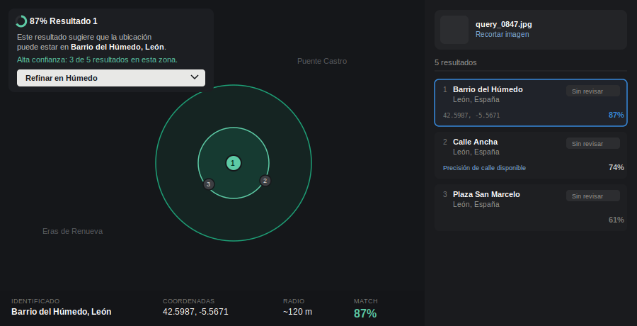
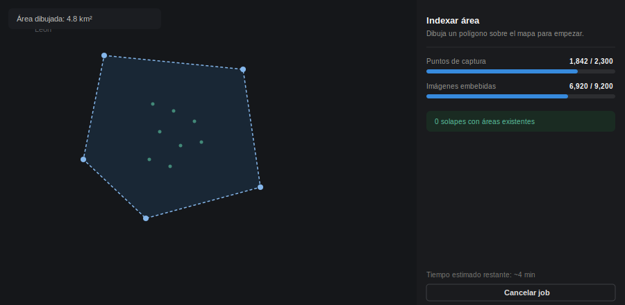

# Netryx Astra Fork — Project Spec

**Estado:** Borrador para revisión — sin código aún.
**Objetivo de este documento:** dejar por escrito el alcance y las decisiones de arquitectura acordadas hasta ahora, antes de convertir esto en un plan de implementación tarea por tarea.

---

## 1. Qué es esto

Fork de [Netryx Astra V2](https://github.com/sparkyniner/Netryx-Astra-V2-Geolocation-Tool), una herramienta de geolocalización que toma una imagen a nivel de calle y encuentra sus coordenadas GPS comparándola contra un índice de panorámicas.

Diferencias respecto al proyecto original:
- Interfaz propia (dashboard estilo mapa oscuro + panel de resultados, ver sección 5).
- Sin el modelo de "índices compartidos por la comunidad" del original — nosotros generamos y controlamos el dataset.
- Fuente de imágenes: Google Street View (Static API), no crowdsourced.

## 2. Alcance del MVP (esto y solo esto, por ahora)

| Decisión | Valor |
|---|---|
| Área de cobertura | ~5 km², una zona de prueba |
| Ciudad/región | Por definir por el usuario (área de test) |
| Fuente de datos | Google Street View Static API |
| Modelos a entrenar desde cero | **Ninguno** |
| Sistema de hexágonos / routing | **Fuera de alcance** — no se construye en este MVP |
| Índice | Flat (fuerza bruta), en memoria |

**Explícitamente fuera de alcance del MVP** (documentado para no perderlo, pero no se toca todavía):
- Clasificador de hexágonos para enrutar la búsqueda (solo tiene sentido a escala ciudad/país/mundo, no a 5km²).
- Jerarquía H3 multi-resolución.
- Dataset propio distribuible / modelo de comunidad.
- Fine-tuning de cualquier backbone (no hay suficiente volumen de datos a esta escala para que aporte algo).

## 3. Arquitectura del pipeline

```
Imagen query
   │
   ▼
[Lumi Preview] ──► descriptor 8448-d L2-normalizado
   │
   ▼
[Búsqueda por similitud coseno, fuerza bruta sobre el índice]
   │
   ▼
Top-k candidatos (con lat/lng/heading/pano_id)
   │
   ▼
[Verificación geométrica: Laila sobre el top-k]
   │
   ▼
Resultado final: coordenadas + score de confianza + imagen(es) de referencia
```

Nota de naming (ver sección 15 para el detalle completo): **Lumi Preview** y **Laila** son los nombres de marca con los que el producto expone sus modelos de retrieval y verificación respectivamente. Internamente son wrappers sobre pesos congelados de MegaLoc y RoMa — no hay fine-tuning de ningún backbone, coherente con la sección 2 ("Modelos a entrenar desde cero: Ninguno"). El resto de esta sección describe la base técnica (MegaLoc/RoMa); la sección 15 describe qué añade cada wrapper y cómo el sistema queda preparado para que el usuario elija entre estos y modelos futuros.

### 3.1 Etapa de retrieval
- **Modelo base:** MegaLoc (`torch.hub.load("gmberton/MegaLoc", "get_trained_model")`), pesos congelados, sin fine-tuning en el MVP. Expuesto en el producto como **Lumi Preview** (sección 15.1).
- **Licencia:** MIT — permite uso, modificación y build encima sin restricciones, requiere mantener atribución.
- **Justificación de no reentrenar nada aquí:** con ~1.000–3.000 puntos de captura (4.000–12.000 imágenes) para 5km², no hay volumen suficiente para que un fine-tune aporte señal real. Se revisita si el proyecto escala a más ciudades.

### 3.2 Etapa de verificación
- **Modelo base:** matcher ligero existente (RoMa) sobre el top-k del retrieval, en vez de reconstrucción 3D densa tipo MASt3R — más barato y suficiente para el objetivo de "confirmar coincidencia", no de reconstruir escena. Expuesto en el producto como **Laila** (sección 15.2). LightGlue queda documentado como alternativa considerada, pero Laila se construye específicamente sobre RoMa.

### 3.3 Índice
- Estructura plana: por cada imagen indexada, se guarda `{descriptor, lat, lng, heading, pano_id}`.
- Búsqueda por coseno directa (sin FAISS/HNSW) — con este volumen la búsqueda exacta es del orden de milisegundos, no se necesita ANN aproximado todavía. Se revisita cuando el índice crezca a escala ciudad completa o superior.


## 4. Pipeline de datos

1. **Definir el área de 5km²** → bounding box lat/lng.
2. **Generar grid de puntos de captura** siguiendo la red de calles (no un grid ciego sobre el bounding box) — usar OpenStreetMap (Overpass API) para extraer la geometría de calles del área y samplear puntos cada ~15-20m a lo largo de ellas.
3. **Consultar Street View Static API** en cada punto, 4 headings (0°/90°/180°/270°) o los que se decidan según el FOV deseado.
4. **Guardar metadata** por imagen: lat, lng, heading, pano_id, timestamp de captura.
5. **Pasar cada imagen por MegaLoc** → guardar descriptor en el índice junto a su metadata.

⚠️ **Nota de riesgo ya discutida y aceptada por el usuario:** el uso de Street View Static API para indexar y reutilizar imágenes fuera del contexto de un mapa de Google entra en tensión con los Términos de Servicio de Google Maps Platform (que prohíben explícitamente el bulk-download, cacheo, e indexación de contenido de Street View fuera del servicio). A esta escala (5km², prueba) el riesgo práctico es bajo, pero sigue siendo formalmente una violación de ToS, no una zona gris. Se documenta aquí para que quede explícito, sin bloquear la decisión del usuario de seguir adelante.

## 5. Dashboard / Interfaz

Referencia visual: 3 capturas de un producto llamado "Raven" (competidor/inspiración), estilo consistente:

- **Mapa:** estilo dark, círculos translúcidos de "zona de confianza" con radio proporcional a la incertidumbre, marcadores numerados por resultado.
- **Panel lateral derecho:** preview de la imagen consultada (con "Crop image" y "Download PDF"), lista de resultados rankeados por % de similitud con coordenadas copiables y estado (Unreviewed/Confirmed), botón de "refinar" que pasa de vista mundial/regional a vista de calle.
- **Barra inferior:** resumen de un vistazo (lugar identificado, coordenadas, radio, % match).

### 5.1 Stack de mapa
- **Mapbox GL JS** para el acabado exacto de las capturas (vector tiles + estilo dark).
- **Fallback recomendado:** MapLibre GL JS (fork open-source, mismo API) + tiles gratuitos (Protomaps / OpenFreeMap) para no depender de un token de pago.
- Círculos de confianza vía turf.js (`turf.circle`) como capas GeoJSON.

### 5.2 Stack de frontend — **DECIDIDO: Next.js**

App Router, cliente puro para el mapa (no SSR para el componente de mapa — Mapbox/MapLibre no funciona en servidor, se monta con `dynamic(() => import(...), { ssr: false })`).

## 6. Modo de indexado ("modo entrenamiento")

Corrección de naming: lo que se describe como "modo entrenamiento" es en realidad **indexado de área** (captura + embedding), no fine-tuning de ningún modelo (ver sección 3.1 — no hay fine-tuning en este proyecto por ahora). En el código y la UI esto se llamará **"Indexar área"**, para no crear confusión futura con un fine-tuning real si algún día se hace.

### 6.1 Flujo de usuario
1. Usuario dibuja un polígono/rectángulo sobre el mapa (Mapbox Draw / `@mapbox/mapbox-gl-draw`, o el equivalente de MapLibre).
2. La UI calcula el área (turf.js `turf.area`) y avisa si excede un límite razonable configurado (para no lanzar por error un job de 500km²).
3. Al confirmar, se crea un **job de indexado** — no se ejecuta de forma síncrona en el request.
4. La UI muestra progreso en tiempo real (puntos capturados / total estimado, imágenes embebidas / total).
5. Al terminar, el área queda marcada como "indexada" y disponible para búsqueda inmediatamente.

### 6.2 Por qué esto NO puede ser una API route de Next.js corriendo el trabajo directamente
Indexar 5km² implica cientos/miles de llamadas a Street View + pasar cada imagen por un modelo de PyTorch. Eso son minutos de trabajo, no algo que quepa en el ciclo de vida de un request HTTP (y menos si en algún punto se despliega en un entorno serverless, donde hay timeout duro). Para que esto sea rápido de verdad (tu requisito), la arquitectura necesita:

- **Cola de trabajos** (**pg-boss**, sobre el propio Postgres — ver nota de Windows en la sección 7) — el request de "indexar esta área" solo encola el job y devuelve un `job_id` al instante. Los workers procesan en paralelo.
- **Servicio de inferencia separado** (Python, FastAPI) con MegaLoc y el matcher **cargados en memoria una sola vez** al arrancar el proceso, no recargados por request — esto es lo que más impacta en velocidad real. Next.js (Node) llama a este servicio por HTTP/gRPC, nunca ejecuta PyTorch directamente.
- **Descarga concurrente** de imágenes de Street View (no secuencial) respetando el rate limit de la API, con dedupe por `pano_id` para no re-descargar lo ya indexado si el área se solapa con otra.
- **Batching de inferencia**: se agrupan varias imágenes por batch antes de pasarlas por MegaLoc en vez de una a una — en GPU esto es la diferencia entre segundos y minutos para miles de imágenes.
- **Progreso en tiempo real**: SSE (Server-Sent Events) desde el backend hacia la UI de Next.js, actualizando la barra de progreso del job (el propio worker escribe el progreso en la tabla `areas` — sección 11 — y un endpoint SSE hace polling ligero de esa fila; no hace falta pub/sub aparte).

### 6.3 Almacenamiento — actualización respecto a la sección 3.3
Con un modo de indexado accesible desde la web (potencialmente varias áreas a lo largo del tiempo), conviene pasar de "índice plano en memoria" a **Postgres + pgvector + PostGIS** desde el inicio:
- `pgvector` para la búsqueda por similitud de embeddings (sigue siendo prácticamente instantáneo a este volumen, e indexable con HNSW cuando crezca).
- `PostGIS` para las consultas espaciales (qué imágenes caen dentro de qué área/bounding box), y para cuando en el futuro se retome la idea de hexágonos, sin tener que migrar de motor de datos.
- Esto no añade complejidad relevante ahora mismo y evita tener que re-arquitecturar el almacenamiento en cuanto haya una segunda área indexada.

## 7. Decisiones cerradas (actualización)

| Pregunta | Decisión |
|---|---|
| Repo | **Nuevo**, no monorepo existente |
| Despliegue | **Self-hosted**, con soporte nativo en Windows como prioridad (ver 7.1) |
| Cola de trabajos | **pg-boss** (cola de jobs sobre el propio Postgres) — reemplaza a Redis+BullMQ, ver justificación abajo |
| Área a indexar | **No es fija** — se selecciona dinámicamente desde el panel de indexado (dibujando el polígono en el mapa, ver 6.1), no hay bounding box hardcodeada en ningún punto del sistema |

### 7.0 Cambio de decisión: por qué pg-boss y no Redis+BullMQ

Redis no tiene soporte oficial en Windows (Microsoft descontinuó su fork hace años) — las alternativas serían Memurai (puerto comercial), o correrlo dentro de WSL2/Docker, justo lo que se quiere evitar. Dado que el requisito es **funcionar en Windows sin Docker si es posible**, la solución más simple es eliminar Redis del stack por completo:

- **pg-boss** es una cola de trabajos implementada como paquete npm que usa el propio Postgres como backend (tablas + `LISTEN/NOTIFY`), no un servicio aparte. Como ya tenemos Postgres en el stack (sección 6.3/11), esto elimina una pieza de infraestructura entera en vez de sustituirla.
- Contras honestos frente a BullMQ: menor throughput bajo carga muy alta, y algunas features de scheduling avanzado de BullMQ no existen en pg-boss. Para el volumen real de este proyecto (unos pocos jobs de indexado concurrentes como máximo, no miles de jobs/segundo) esto no es una limitación práctica — es la elección correcta aquí, no un compromiso a la baja.
- Si en el futuro el volumen de jobs creciera muchísimo (muchas áreas indexándose a la vez, muchos usuarios), se puede migrar a Redis+BullMQ más adelante sin rediseñar el resto del sistema — el worker solo cambia su fuente de jobs, no la lógica de negocio.

### 7.1 Implicaciones de "self-hosted en Windows, sin Docker" en el diseño

- **Next.js (`web`) y el worker (`apps/worker`)** corren de forma nativa en Windows sin ningún problema — son procesos Node normales (`node`/`pnpm start`), no necesitan Docker.
- **Postgres**: instalador oficial de Windows (EDB) — nativo, sin Docker.
  - **pgvector** en Windows: requiere compilar con Visual Studio (`nmake`), o más simple, usar binarios precompilados de terceros ([`portalcorp/pgvector_compiled`](https://github.com/portalcorp/pgvector_compiled) o [`andreiramani/pgvector_pgsql_windows`](https://github.com/andreiramani/pgvector_pgsql_windows)) — se copian los archivos a la carpeta de extensiones de Postgres y listo, sin necesidad de toolchain de compilación.
  - **PostGIS** en Windows: se instala vía Stack Builder, que viene incluido con el instalador oficial de PostgreSQL para Windows — un checkbox más durante la instalación, nativo.
- **Servicio de inferencia (Python/FastAPI, MegaLoc + matcher)**: PyTorch tiene soporte nativo de CUDA en Windows (no hace falta WSL para esto) — se instala en un entorno virtual de Python normal (`venv`) y se lanza como proceso (`uvicorn`), sin contenedor.
- **pg-boss**: al vivir sobre Postgres, no añade ninguna pieza nueva que instalar en Windows — ver 7.0.
- **Docker sigue siendo una opción**, no obligatoria: si en algún momento se prefiere no gestionar instalaciones nativas una por una, todo el stack anterior también puede empaquetarse en contenedores (incluyendo un `Dockerfile` con Windows containers o, más simple, Linux containers vía Docker Desktop + WSL2 backend). Se documenta como fallback, no como el camino principal.
- **Orquestación de procesos nativos**: en vez de `docker-compose up`, se usa un gestor de procesos ligero multiplataforma como **PM2** (`pm2 start ecosystem.config.js`) para levantar `web`, `worker` e `inference` con un solo comando, con reinicio automático si algún proceso muere — el equivalente funcional a Compose pero sin contenedores.
- **Empaquetado futuro (opcional, no MVP)**: dado que en tus otros proyectos (`tsuki-workstation`) ya usas Inno Setup para instaladores Windows de stacks con múltiples procesos, este proyecto encaja en el mismo patrón el día que se quiera un instalador de un solo clic — no es necesario para el MVP, pero es la ruta natural más adelante.

### 7.2 Estructura de repo (nuevo repo, propuesta inicial)

```
netryx-fork/
├── apps/
│   ├── web/              # Next.js (dashboard, mapa, panel de indexado)
│   └── worker/           # Worker Node que consume BullMQ, orquesta jobs de indexado
├── services/
│   └── inference/        # FastAPI — MegaLoc + matcher, cargados en memoria al arrancar
├── packages/
│   └── shared-types/     # Tipos TS compartidos entre web y worker (payloads de job, resultados)
├── docker-compose.yml
└── docs/
    └── superpowers/
        └── plans/
```

Esto es un monorepo interno (pnpm workspaces) solo para este proyecto — no confundir con la pregunta ya resuelta de "repo nuevo vs. monorepo existente `tsuki-team`/`s7lver2`", que se refería a si vivía dentro de tus repos actuales (no).

## 8. UI/UX detallada

### 8.1 Rutas (Next.js App Router)

| Ruta | Propósito |
|---|---|
| `/` | Dashboard principal — subir imagen, ver mapa + resultados (como las 3 capturas de referencia) |
| `/index` | Panel de indexado — dibujar área, lanzar job, ver progreso en vivo |
| `/areas` | Listado de áreas ya indexadas (nº imágenes, km², fecha, estado) |
| `/areas/[id]` | Detalle de un área — mapa con los puntos capturados, opción de reindexar/borrar |
| `/settings` | Configuración de producto (API keys, límites de coste/área/concurrencia, selección de modelo Lumi Preview/Laila) — ver secciones 14 y 15 |
| `/setup` | Wizard de primer arranque, solo accesible si la config aún no existe — ver 14.2 |

### 8.2 Componentes principales

- **`MapCanvas`** — wrapper client-only de Mapbox/MapLibre (`ssr: false`), compartido entre `/` y `/index` con distintos "modos" (búsqueda vs. dibujo).
- **`ImageDropzone`** — subida de la imagen query en `/`, con preview + crop (como "Crop image" de las capturas).
- **`ResultsPanel`** — lista de resultados rankeados: thumbnail, % similitud (circular progress), coordenadas copiables, estado (Unreviewed/Confirmed), botón "Refinar" que hace zoom a vista de calle.
- **`ConfidenceCircleLayer`** — capa GeoJSON sobre el mapa (turf.js `circle`) para las zonas de confianza.
- **`IndexingDrawTool`** — wrapper de `@mapbox/mapbox-gl-draw` (o el plugin equivalente de MapLibre) para dibujar el polígono del área a indexar, con cálculo de área en vivo (turf.js `area`) y aviso si excede el límite configurado.
- **`JobProgressBar`** — conectado por SSE al progreso del job de indexado (puntos capturados / total, imágenes embebidas / total).
- **`AreaCard`** — tarjeta de área indexada en `/areas`, con badge de estado.

### 8.2.1 Mockups de referencia

**Dashboard de búsqueda** (`/`) — mapa oscuro con zonas de confianza, card flotante con el resultado top y botón "Refinar", panel derecho con resultados rankeados, barra inferior de resumen:



**Panel de indexado** (`/index`) — polígono dibujado sobre el mapa, puntos de muestreo, progreso en vivo de puntos capturados e imágenes embebidas, aviso de solapamiento:



Ambos siguen el lenguaje visual de las capturas de referencia (mapa dark, cards flotantes translúcidas, badges de estado, coordenadas monoespaciadas).

### 8.3 Estados de UI a cubrir explícitamente (para no dejar huecos en el plan)
- Sin resultados / confianza muy baja (todas las capturas de referencia asumen que siempre hay match — el diseño real necesita un estado "no se encontró coincidencia suficiente").
- Job de indexado fallido a medias (ej. Street View sin cobertura en parte del área) — mostrar cuántos puntos fallaron, no solo éxito/fracaso binario.
- Área solapada con una ya indexada — avisar antes de lanzar el job, no descubrirlo después (gracias al dedupe por `pano_id` de la sección 6.2, pero la UI debe comunicarlo).

## 9. Flujo funcional end-to-end

### 9.1 Indexar un área
1. Usuario dibuja el polígono en `/index` → la UI calcula el área y avisa si excede el límite.
2. `POST /api/areas` crea el registro (`status: "pending"`) en Postgres con la geometría (PostGIS) y encola el job en Redis vía BullMQ.
3. El worker recoge el job:
   - Consulta Overpass API (OpenStreetMap) para obtener la geometría de calles dentro del polígono.
   - Samplea puntos cada ~15-20m a lo largo de esas calles.
   - Filtra puntos cuyo `pano_id` ya exista en la DB (evita recapturar zonas solapadas con áreas previas).
   - Descarga imágenes de Street View Static API de forma concurrente (respetando rate limit) para los headings configurados.
   - Envía las imágenes en batches al servicio de inferencia (`POST /embed`).
   - Inserta cada `{descriptor, lat, lng, heading, pano_id, area_id}` en Postgres (pgvector).
   - Publica progreso (Redis pub/sub o `job.progress()` de BullMQ) en cada batch procesado.
4. `/index` recibe el progreso por SSE y actualiza la barra en vivo.
5. Al terminar, `status: "indexed"` — el área queda disponible para búsqueda de inmediato (no hace falta ningún paso de "entrenamiento" adicional, ver sección 6).

### 9.2 Buscar una imagen (pase 1 — barato, siempre se ejecuta)
1. Usuario sube una imagen en `/`.
2. `POST /api/search` reenvía la imagen al servicio de inferencia (`POST /embed`) para obtener su descriptor.
3. Se consulta Postgres/pgvector (distancia coseno) contra los descriptores de las áreas indexadas → top-k candidatos (ej. k=50).
4. **Clustering espacial** sobre esos top-k (DBSCAN o clustering por radio) — se agrupan los candidatos que caen físicamente cerca entre sí en "regiones". Esto es lo que produce el "4 de 5 resultados están en esta región" de los mockups: de los top-k candidatos por similitud, la mayoría cae dentro del mismo radio.
5. Se devuelven las regiones con su score agregado (score del mejor candidato de la región, o media) y sus candidatos asociados. **No se ejecuta verificación geométrica en este pase** — solo comparación de embeddings, barata incluso contra miles de candidatos.
6. `ResultsPanel` recibe la lista de regiones/candidatos; `ConfidenceCircleLayer` dibuja las zonas en el mapa.

### 9.3 Refinar búsqueda (pase 2 — caro, solo bajo demanda)

La refinación separa "¿en qué zona aproximada estamos?" (pase 1, barato) de "¿cuál es la dirección exacta?" (pase 2, verificación geométrica real). El pase 2 solo se dispara cuando el usuario pulsa "Refinar en [región]", nunca automáticamente sobre todo el índice.

1. Usuario elige una región del pase 1 (la sugerida por defecto, u otra desde el dropdown "N regiones disponibles").
2. `POST /api/search/:searchId/refine` con `{ regionId }`.
3. **Búsqueda ampliada restringida a la zona**: se traen todos los puntos indexados dentro del radio de esa región (PostGIS `ST_DWithin`), no solo los que entraron en el top-k global del pase 1 — puede haber puntos con similitud algo menor que sí son relevantes una vez acotada la zona.
4. Sobre ese conjunto (ya pequeño y acotado geográficamente) se ejecuta el matcher geométrico (`POST /verify` en el servicio de inferencia, LightGlue/RoMa) contra cada candidato — esta es la parte cara, y por eso solo corre una vez que se sabe en qué zona concentrar el esfuerzo.
5. Los resultados se re-rankean por score de verificación geométrica (no por similitud de embedding) → vista street-level con ranking `1 de N`, coordenadas exactas por punto de captura.
6. Si el score de verificación del top-1 supera un umbral configurado, el resultado pasa de `Sin revisar` a `Confirmado` automáticamente.

### 9.4 Endpoints de búsqueda (resumen)

| Endpoint | Pase | Qué hace |
|---|---|---|
| `POST /api/search` | 1 | Embedding + similitud + clustering espacial → regiones |
| `POST /api/search/:searchId/refine` | 2 | Búsqueda ampliada en la región + verificación geométrica → ranking street-level |
| `POST /embed` (servicio inferencia) | 1 y 2 | Descriptor MegaLoc de una imagen |
| `POST /verify` (servicio inferencia) | 2 | Verificación geométrica LightGlue/RoMa entre query y candidato |


## 10. Instalación (self-hosted)

### 10.1 Requisitos
- Docker + Docker Compose.
- (Recomendado, no obligatorio) GPU NVIDIA + `nvidia-container-toolkit` — el servicio de inferencia corre en CPU si no hay GPU, pero mucho más lento.
- Cuenta de Google Cloud con **Street View Static API** habilitada y billing activo (API key propia).
- Sin dependencia obligatoria de token de Mapbox si se usa el fallback MapLibre + tiles gratuitos (Protomaps/OpenFreeMap) — token de Mapbox opcional si se prefiere ese acabado exacto.

### 10.2 Pasos
```bash
git clone <repo-nuevo>
cd netryx-fork
cp .env.example .env
# Rellenar solo lo mínimo de infraestructura: POSTGRES_*, PORT — ver sección 14 (ya no hace falta
# meter aquí la API key de Street View, Mapbox, ni los límites de coste/área)
docker compose up -d --build   # o pm2 start ecosystem.config.js en Windows nativo (ver 7.1)
docker compose exec web pnpm prisma migrate deploy   # o el ORM que se decida en el plan
```
Acceso: `http://localhost:3000` → primer arranque redirige automáticamente a `/setup` (ver sección 14) para meter el resto de la configuración desde la propia web, sin tocar el `.env` a mano.

### 10.3 Nota sobre acceso — decisión: sin autenticación por ahora
Se decide no añadir autenticación en el MVP, al ser self-hosted. Esto se documenta como una **asunción explícita**, no como algo neutral: el stack asume que el `docker compose up` corre en una red de confianza (localhost / red local / detrás de un firewall propio), nunca expuesto directamente a internet sin al menos un proxy con auth delante. La razón sigue siendo la misma de antes — la API de Street View se paga con tu propia key, así que cualquiera con acceso al dashboard consume tu cuota (ver sección 12). Si en algún momento se expone el dashboard fuera de la red local, esto hay que revisarlo antes, no después.

## 11. Esquema de base de datos (Postgres + pgvector + PostGIS)

```sql
CREATE EXTENSION IF NOT EXISTS vector;
CREATE EXTENSION IF NOT EXISTS postgis;

CREATE TABLE areas (
  id                    uuid PRIMARY KEY DEFAULT gen_random_uuid(),
  name                  text,
  geometry              geometry(Polygon, 4326) NOT NULL,
  area_km2              numeric NOT NULL,
  status                text NOT NULL DEFAULT 'pending', -- pending | indexing | indexed | failed
  points_estimated      integer NOT NULL DEFAULT 0,
  points_captured       integer NOT NULL DEFAULT 0,
  images_embedded       integer NOT NULL DEFAULT 0,
  estimated_cost_usd    numeric,
  actual_cost_usd       numeric,
  created_at            timestamptz NOT NULL DEFAULT now(),
  updated_at            timestamptz NOT NULL DEFAULT now()
);

CREATE TABLE indexed_images (
  id                    uuid PRIMARY KEY DEFAULT gen_random_uuid(),
  area_id               uuid NOT NULL REFERENCES areas(id) ON DELETE CASCADE,
  pano_id               text NOT NULL,
  heading               smallint NOT NULL,
  location              geography(Point, 4326) NOT NULL,
  street_view_date      date,
  embedding             vector(8448),
  embedded_at           timestamptz,
  created_at            timestamptz NOT NULL DEFAULT now(),
  UNIQUE (pano_id, heading)
);
CREATE INDEX idx_indexed_images_location ON indexed_images USING GIST (location);
CREATE INDEX idx_indexed_images_embedding ON indexed_images USING hnsw (embedding vector_cosine_ops);

CREATE TABLE searches (
  id                    uuid PRIMARY KEY DEFAULT gen_random_uuid(),
  query_image_path      text NOT NULL,
  query_embedding       vector(8448),
  created_at            timestamptz NOT NULL DEFAULT now()
);

CREATE TABLE search_regions (
  id                    uuid PRIMARY KEY DEFAULT gen_random_uuid(),
  search_id             uuid NOT NULL REFERENCES searches(id) ON DELETE CASCADE,
  centroid              geography(Point, 4326) NOT NULL,
  radius_m              integer NOT NULL,
  aggregate_score       numeric NOT NULL,
  candidate_count       integer NOT NULL
);

CREATE TABLE search_candidates (
  id                    uuid PRIMARY KEY DEFAULT gen_random_uuid(),
  search_id             uuid NOT NULL REFERENCES searches(id) ON DELETE CASCADE,
  region_id             uuid REFERENCES search_regions(id) ON DELETE SET NULL,
  indexed_image_id      uuid NOT NULL REFERENCES indexed_images(id),
  similarity_score      numeric NOT NULL,
  verification_score    numeric,
  rank                  integer NOT NULL,
  status                text NOT NULL DEFAULT 'unreviewed' -- unreviewed | confirmed
);

CREATE TABLE api_usage (
  id                    uuid PRIMARY KEY DEFAULT gen_random_uuid(),
  date                  date NOT NULL DEFAULT current_date,
  street_view_requests  integer NOT NULL DEFAULT 0,
  estimated_cost_usd    numeric NOT NULL DEFAULT 0,
  UNIQUE (date)
);
```

Notas:
- `indexed_images.embedding` es nullable porque el worker inserta la fila al capturar el punto y rellena el embedding en un paso posterior (batch) — permite reanudar un job a medias sin perder los puntos ya descargados.
- El índice `hnsw` sobre `embedding` es el que hace que la búsqueda en pgvector siga siendo rápida aunque el índice crezca más allá de lo trivial (con pocos miles de filas ni haría falta, pero no cuesta nada tenerlo desde el principio).
- `search_candidates.region_id` es nullable porque en teoría puede haber candidatos del top-k que no caigan en ninguna región tras el clustering (outliers aislados).

## 12. Gestión de cuota y coste de la API de Street View

Esto es importante precisamente porque no hay autenticación (sección 10.3) — cualquier job de indexado gasta dinero real de tu cuenta de Google Cloud, así que el sistema tiene que ponerse límites a sí mismo, no confiar en que el usuario calcule bien.

### 12.1 Estimación de coste antes de lanzar el job
Al dibujar el polígono en `/index`, antes de confirmar:
1. Se calcula el nº estimado de puntos de captura (según densidad de calles vía Overpass) × nº de headings configurados = nº de llamadas a Street View Static API.
2. Se multiplica por el precio por imagen de la Street View Static API (configurable en `.env`, ya que Google puede cambiar precios).
3. Se muestra **"Coste estimado: ~$X"** en el panel de indexado antes del botón de confirmar — no después.

### 12.2 Límites duros (config en `.env`)
- `MAX_AREA_KM2` — rechaza polígonos por encima de este tamaño directamente en la UI (turf.js `area`) antes de tocar el backend.
- `MAX_MONTHLY_BUDGET_USD` — el worker consulta la tabla `api_usage` antes de lanzar cada job; si el gasto acumulado del mes ya supera el límite, el job se rechaza con un error explícito, no se lanza parcialmente.
- `MAX_CONCURRENT_REQUESTS` — límite de peticiones simultáneas a Street View Static API (rate limiting propio, vía semáforo/`p-limit` en el worker), independiente de si Google también aplica su propio límite — evita que un pico de concurrencia dispare un bloqueo de la cuenta.

### 12.3 Tracking de gasto real
- Cada llamada exitosa a Street View Static API incrementa `api_usage.street_view_requests` y `estimated_cost_usd` del día correspondiente (upsert).
- `areas.actual_cost_usd` se calcula al terminar el job sumando las llamadas realmente hechas para esa área (no el estimado inicial) — así el usuario ve estimado vs. real.
- Reintentos con backoff exponencial en caso de error 429/5xx de la API, pero **los reintentos fallidos no cuentan doble** en el contador de coste si Google no llegó a servir la imagen.

## 13. Estado global del frontend (Zustand)

Tres stores separados por dominio, no uno monolítico — cada uno con responsabilidad clara:

```ts
// stores/useSearchStore.ts
interface SearchState {
  currentSearchId: string | null;
  regions: SearchRegion[];
  candidatesByRegion: Record<string, SearchCandidate[]>;
  selectedRegionId: string | null;
  refineStatus: 'idle' | 'refining' | 'done' | 'error';
  setSearchResults: (searchId: string, regions: SearchRegion[]) => void;
  selectRegion: (regionId: string) => void;
  setRefineResults: (regionId: string, candidates: SearchCandidate[]) => void;
}

// stores/useIndexingStore.ts
interface IndexingState {
  drawnPolygon: GeoJSON.Polygon | null;
  areaKm2: number;
  estimatedCostUsd: number | null;
  activeJobId: string | null;
  jobProgress: { pointsCaptured: number; pointsTotal: number; imagesEmbedded: number; imagesTotal: number } | null;
  setDrawnPolygon: (polygon: GeoJSON.Polygon, areaKm2: number) => void;
  startJob: (jobId: string) => void;
  updateProgress: (progress: IndexingState['jobProgress']) => void;
}

// stores/useMapStore.ts
interface MapState {
  mode: 'search' | 'draw';
  viewport: { lat: number; lng: number; zoom: number };
  setMode: (mode: MapState['mode']) => void;
  setViewport: (viewport: MapState['viewport']) => void;
}
```

Por qué separados: `useMapStore` lo consumen tanto `/` como `/index` (mismo `MapCanvas`), pero `useSearchStore` y `useIndexingStore` son exclusivos de cada ruta — mezclarlos en un store único acoplaría estado que no tiene por qué cambiar junto. `jobProgress` se actualiza desde el listener de SSE (sección 6.2), no desde un fetch manual.

## 14. Configuración desde la web (setup de primer arranque + `/settings`)

Cambio respecto a la sección 10.2: en vez de rellenar `GOOGLE_MAPS_API_KEY`, `MAPBOX_TOKEN` y los límites de coste/área a mano en el `.env`, la app los pide en un wizard la primera vez que arranca, y quedan editables después en `/settings`. Esto no elimina el `.env` por completo — hay una capa que **tiene** que seguir viviendo ahí, por una razón estructural, no de gusto.

### 14.1 Qué se queda en `.env` y qué se mueve a la web

| Variable | Dónde vive | Por qué |
|---|---|---|
| `POSTGRES_HOST` / `PORT` / `USER` / `PASSWORD` / `DB` (o `DATABASE_URL`) | `.env` | La app necesita saber cómo conectar a Postgres *antes* de poder leer nada de Postgres — no se puede resolver este dato desde una tabla de esa misma base de datos. |
| `PORT` (puerto de `web`), `NODE_ENV` | `.env` | Necesarios antes de que Next.js levante el servidor HTTP que serviría el propio wizard. |
| `SETTINGS_ENCRYPTION_KEY` | `.env` (autogenerada si falta, ver 14.4) | Es la clave que cifra los secretos que sí viven en DB (14.3) — no puede vivir en la misma tabla que cifra. |
| `GOOGLE_MAPS_API_KEY` | DB (`system_settings`), vía `/setup` → `/settings` | Configuración de producto, no de infraestructura — el usuario debe poder rotarla sin reiniciar contenedores. |
| `MAPBOX_TOKEN` (opcional) | DB (`system_settings`) | Igual que la anterior. |
| `MAX_AREA_KM2`, `MAX_MONTHLY_BUDGET_USD`, `MAX_CONCURRENT_REQUESTS`, precio por imagen de Street View (sección 12) | DB (`system_settings`) | Son límites de negocio que tiene sentido ajustar sin redeploy, y que además se muestran/editan en la misma UI que ya calcula coste estimado (sección 12.1). |
| `RETRIEVAL_MODEL`, `VERIFICATION_MODEL` (sección 15) | DB (`system_settings`) | Selección de modelo entre Lumi Preview/Laila y los que se añadan a futuro — es una preferencia de producto que debe poder cambiarse sin redeploy, igual que los límites de arriba. |

El `.env.example` del repo queda reducido a la primera columna — solo lo estrictamente necesario para que el proceso arranque y pueda hablar con Postgres.

### 14.2 Flujo de primer arranque

1. Middleware de Next.js (`middleware.ts`) comprueba en cada request si `system_settings.setup_completed = true`. Esta comprobación se cachea en memoria del proceso (con invalidación al guardar el wizard) para no pegarle a Postgres en cada petición.
2. Si no está completado, cualquier ruta que no sea `/setup` (ni sus API routes) redirige a `/setup`.
3. `/setup` es un wizard de pasos simples (no una sola pantalla larga):
   - **Paso 1 — Street View:** `GOOGLE_MAPS_API_KEY`, con un botón "Probar conexión" que hace una llamada mínima a la Static API antes de dejar avanzar (evita descubrir una key mal copiada a mitad del primer job de indexado).
   - **Paso 2 — Mapa (opcional):** `MAPBOX_TOKEN`, con opción explícita "Usar MapLibre + tiles gratuitas (sin token)" que salta este paso — coherente con el fallback ya decidido en la sección 5.1.
   - **Paso 3 — Límites:** `MAX_AREA_KM2`, `MAX_MONTHLY_BUDGET_USD`, `MAX_CONCURRENT_REQUESTS`, con valores por defecto sensatos ya rellenados (no campos vacíos) para que baste con pulsar "Siguiente" si el usuario no quiere pensarlo ahora.
   - **Paso 4 — Confirmación:** resumen de lo introducido → botón "Finalizar setup", que escribe todo en `system_settings` en una sola transacción y marca `setup_completed = true`.
4. Al finalizar, redirige a `/` normalmente. El wizard no vuelve a aparecer salvo que se borre esa fila manualmente (vía de escape para reconfigurar desde cero si algo se rompe).

### 14.3 Tabla `system_settings`

```sql
CREATE TABLE system_settings (
  key                   text PRIMARY KEY,
  value                 text NOT NULL,          -- valor en claro para settings no sensibles
  encrypted_value        bytea,                  -- valor cifrado (AES-256-GCM) para API keys/tokens
  is_secret             boolean NOT NULL DEFAULT false,
  updated_at            timestamptz NOT NULL DEFAULT now()
);

-- Fila especial, no una setting de producto: marca si el wizard ya se completó
-- key = '__setup_completed__', value = 'true' | 'false'
```

Notas:
- Los valores marcados `is_secret` (la API key de Street View, el token de Mapbox) se guardan solo en `encrypted_value`, nunca en `value` en claro — `value` queda `NULL` para esas filas.
- Cifrado simétrico (AES-256-GCM) con `SETTINGS_ENCRYPTION_KEY` como clave — igual de simple de implementar en Node (`crypto` nativo) que en el worker si algún día necesita leer un secreto directamente.
- Se prefiere una tabla clave-valor genérica a columnas fijas en una tabla `config` porque los límites de la sección 12 ya pueden crecer (por ejemplo, un futuro límite por-área además del global) sin migración.

### 14.4 `SETTINGS_ENCRYPTION_KEY` — autogenerada, no pedida al usuario

Pedirle al usuario que invente una clave de cifrado en el wizard sería un mal diseño (nadie hace eso bien a mano, y es justo el tipo de dato que *no* debería vivir en la DB que cifra). En su lugar:
- Al arrancar, si `SETTINGS_ENCRYPTION_KEY` no está definida en el entorno, el proceso genera una clave aleatoria de 32 bytes y la escribe en un archivo local fuera del repo y fuera de la DB (`./data/settings.key`, en `.gitignore` desde el primer commit).
- En arranques posteriores, si el archivo ya existe, se lee de ahí en vez de regenerar (regenerar dejaría ilegibles los secretos ya cifrados en `system_settings`).
- Se documenta explícitamente en el README: **si se pierde `./data/settings.key`, hay que volver a pasar por `/setup` y re-introducir las API keys** — no hay recuperación posible del valor cifrado sin la clave. Esto es aceptable para este proyecto (son API keys reemplazables, no datos irrecuperables del usuario) pero debe quedar dicho, no descubierto.
- En el setup nativo de Windows sin Docker (sección 7.1), `./data/` es una carpeta normal junto al resto de la app — no hay nada especial que instalar para esto.

### 14.5 Cómo leen la configuración el worker y el servicio de inferencia

- El **worker** (`apps/worker`) no recibe estos valores por variables de entorno — al arrancar cada job de indexado, consulta `system_settings` (con un caché en memoria de TTL corto, ~30s, para no golpear la tabla en cada punto de captura) para leer `GOOGLE_MAPS_API_KEY` y los límites de la sección 12. Esto significa que cambiar la API key en `/settings` aplica al *siguiente* job sin reiniciar el worker.
- El **servicio de inferencia** (Python/FastAPI) **sí necesita leer `system_settings`** — a diferencia de lo asumido en una versión anterior de este documento, ahora tiene que saber qué modelo cargar (`RETRIEVAL_MODEL`/`VERIFICATION_MODEL`, sección 15). Al arrancar consulta ambos valores una vez y carga en memoria los modelos correspondientes; no vuelve a consultar `system_settings` en cada request de `/embed` o `/verify` (seguiría siendo demasiado por-request). Si el usuario cambia el modelo en `/settings`, el cambio no aplica hasta el siguiente reinicio del servicio de inferencia — ver 15.4 para cómo se comunica esto en la UI.
- Si `GOOGLE_MAPS_API_KEY` no está configurada todavía (setup no completado) y por alguna razón se intenta lanzar un job de indexado, `POST /api/areas` rechaza la petición con un error explícito en vez de encolar un job que va a fallar en el primer punto de captura.

## 15. Modelos: Lumi Preview, Laila, y selección extensible

Naming de producto: los modelos de retrieval y verificación no se muestran al usuario con sus nombres técnicos (MegaLoc, RoMa) sino con nombre propio — **Lumi Preview** para retrieval, **Laila** para verificación. Ninguno de los dos es un modelo entrenado desde cero ni fine-tuneado: ambos son wrappers sobre los pesos congelados ya decididos en la sección 3, con mejoras que actúan *alrededor* del modelo base (pre/post-procesado, agregación, re-ranking, mejor estimador robusto), nunca tocando los pesos. Esto mantiene intacta la decisión de la sección 2 ("Modelos a entrenar desde cero: Ninguno").

### 15.1 Lumi Preview (retrieval, base MegaLoc)

Mejoras sobre MegaLoc congelado, todas sin reentrenamiento:
- **Agregación multi-heading en la captura:** en vez de indexar cada heading (0°/90°/180°/270°) como un descriptor independiente (sección 4), Lumi Preview también calcula y almacena un descriptor agregado por punto de captura (media L2-normalizada de los 4 headings), útil cuando la imagen query no tiene un heading claramente dominante.
- **Test-time augmentation en la query:** la imagen subida por el usuario se pasa por MegaLoc en su forma original y en 1-2 variantes (flip horizontal, crop central), promediando los descriptores resultantes — mejora la robustez a encuadres distintos sin coste de entrenamiento, a cambio de 2-3x más cómputo por query (aceptable: la query es una sola imagen, no miles).
- **Re-ranking por expansión de vecinos (query expansion / k-reciprocal):** sobre el top-k inicial por coseno, se recalcula el score promediando el descriptor de la query con los descriptores de sus vecinos más cercanos en el índice, y se re-rankea — técnica estándar de retrieval que no requiere entrenar nada, solo álgebra sobre embeddings ya calculados.
- **Nombre de versión:** "Preview" porque estas técnicas (especialmente el re-ranking) se afinan con datos reales de las primeras áreas indexadas — el pipeline base (MegaLoc + coseno) sigue siendo el fallback si alguna de estas etapas falla o se desactiva.

### 15.2 Laila (verificación geométrica, base RoMa)

Mejoras sobre RoMa congelado, todas sin reentrenamiento:
- **Matching en tiles multi-resolución:** en vez de correr RoMa una sola vez sobre la imagen completa, Laila la divide en tiles solapados a 2 resoluciones y agrega los matches — mejora la cobertura de puntos de interés pequeños/lejanos (ej. números de portal, señalética) sin cambiar el modelo.
- **Estimador robusto MAGSAC++ en vez de RANSAC estándar:** para ajustar la transformación geométrica entre query y candidato a partir de los matches, se usa MAGSAC++ (no requiere ajustar un umbral de inliers a mano, más robusto a outliers) — es un cambio en la etapa de *estimación*, posterior al matching, no en la red neuronal.
- **Score de confianza calibrado:** el score que decide si un resultado pasa a "Confirmado" (sección 9.3) no es el score crudo de RoMa sino una combinación de nº de inliers tras MAGSAC++ + error de reproyección — calibrado empíricamente sobre las primeras áreas indexadas, igual que Lumi Preview.

### 15.3 Registro de modelos (arquitectura para elegir entre Lumi Preview / Laila y futuros modelos)

El requisito de que el usuario pueda elegir entre Lumi Preview (o Laila) y modelos que se añadan más adelante implica que ninguno de los dos puede estar hardcodeado en el servicio de inferencia. Se introduce un **registro de modelos**, un array de definiciones en `services/inference/models/registry.py` (y su espejo de tipos en `packages/shared-types` para que el frontend sepa qué opciones mostrar sin duplicar la lista a mano):

```python
# services/inference/models/registry.py
RETRIEVAL_MODELS = [
    {
        "id": "lumi-preview",
        "display_name": "Lumi Preview",
        "base_model": "MegaLoc (congelado)",
        "status": "preview",
        "embedding_dim": 8448,
    },
    # futuros modelos de retrieval se añaden aquí, sin tocar el resto del código
]

VERIFICATION_MODELS = [
    {
        "id": "laila",
        "display_name": "Laila",
        "base_model": "RoMa (congelado)",
        "status": "stable",
    },
    # futuros modelos de verificación se añaden aquí
]
```

```typescript
// packages/shared-types/src/models.ts
export interface ModelDefinition {
  id: string;
  displayName: string;
  baseModel: string;
  status: "preview" | "stable" | "deprecated";
}

// Mantenido en sincronía manual con services/inference/models/registry.py —
// el backend es la fuente de verdad para qué modelo se ejecuta, este array
// es solo para poblar el <select> de /settings sin una llamada de red extra.
export const RETRIEVAL_MODELS: ModelDefinition[] = [
  { id: "lumi-preview", displayName: "Lumi Preview", baseModel: "MegaLoc (congelado)", status: "preview" },
];

export const VERIFICATION_MODELS: ModelDefinition[] = [
  { id: "laila", displayName: "Laila", baseModel: "RoMa (congelado)", status: "stable" },
];
```

- `RETRIEVAL_MODEL` y `VERIFICATION_MODEL` se añaden a `SETTINGS_SCHEMA` (sección 14, `packages/shared-types/src/settings.ts`) como settings de tipo `"enum"` (nuevo tipo, además de `"string"`/`"number"`), con `options` derivadas de `RETRIEVAL_MODELS`/`VERIFICATION_MODELS` y default `"lumi-preview"`/`"laila"`.
- El `<select>` en `/settings` (sección 14) itera esas opciones — añadir un modelo nuevo en el futuro es solo agregar una entrada al registro Python (y su espejo TS), no tocar la UI ni el wizard de `/setup`.
- `embedding_dim` en el registro de retrieval existe porque cambia el tipo de columna `vector(N)` en `indexed_images.embedding` (sección 11) si un futuro modelo usa una dimensión distinta a 8448 — **implica migración de esquema y reindexado completo**, no un simple cambio de setting; se documenta aquí para que quede explícito y no se descubra en producción.

### 15.4 Por qué cambiar de modelo no es instantáneo (coherente con 14.5)

El servicio de inferencia carga el modelo seleccionado en memoria **una sola vez al arrancar** (decisión ya tomada en la sección 6.2 por rendimiento). Esto significa:
- Cambiar `RETRIEVAL_MODEL` o `VERIFICATION_MODEL` en `/settings` no re-carga el modelo en caliente — requiere reiniciar el proceso del servicio de inferencia (`pm2 restart inference` en el setup nativo de Windows, sección 7.1).
- La UI de `/settings` debe comunicar esto explícitamente (ej. aviso "Este cambio requiere reiniciar el servicio de inferencia para aplicarse" tras guardar), en vez de dar a entender que el cambio es inmediato como sí lo es con la API key de Street View (sección 14.5).
- Alternativa descartada por ahora: cargar todos los modelos registrados en memoria simultáneamente para poder cambiar sin reinicio. Se descarta porque el requisito de "self-hosted en Windows sin Docker" (sección 7.1) no garantiza VRAM suficiente para tener varios backbones cargados a la vez — un modelo a la vez es la opción segura por defecto. Se revisita si en el futuro se soporta selección per-request en vez de global.
- Reindexar un área ya indexada con un modelo de retrieval distinto (dimensión de embedding distinta o no) **no es automático** — queda fuera de alcance de este documento y se trata como una operación manual de "reindexar área" (ya prevista como opción en `/areas/[id]`, sección 8.1).

---

**Siguiente paso:** una vez resueltas las preguntas de la sección 6, esto se convierte en un plan de implementación tarea por tarea (archivos exactos, tests, comandos) siguiendo el formato estándar de `docs/superpowers/plans/`.
---

**Siguiente paso:** con todas las decisiones de arquitectura, UI, despliegue, datos y coste cerradas, esto ya está listo para convertirse en un plan de implementación tarea por tarea (archivos exactos, tests, comandos) siguiendo el formato estándar de `docs/superpowers/plans/`.
